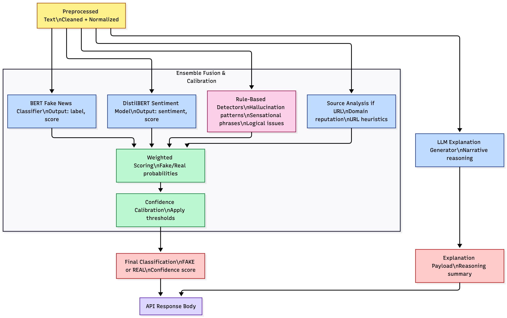
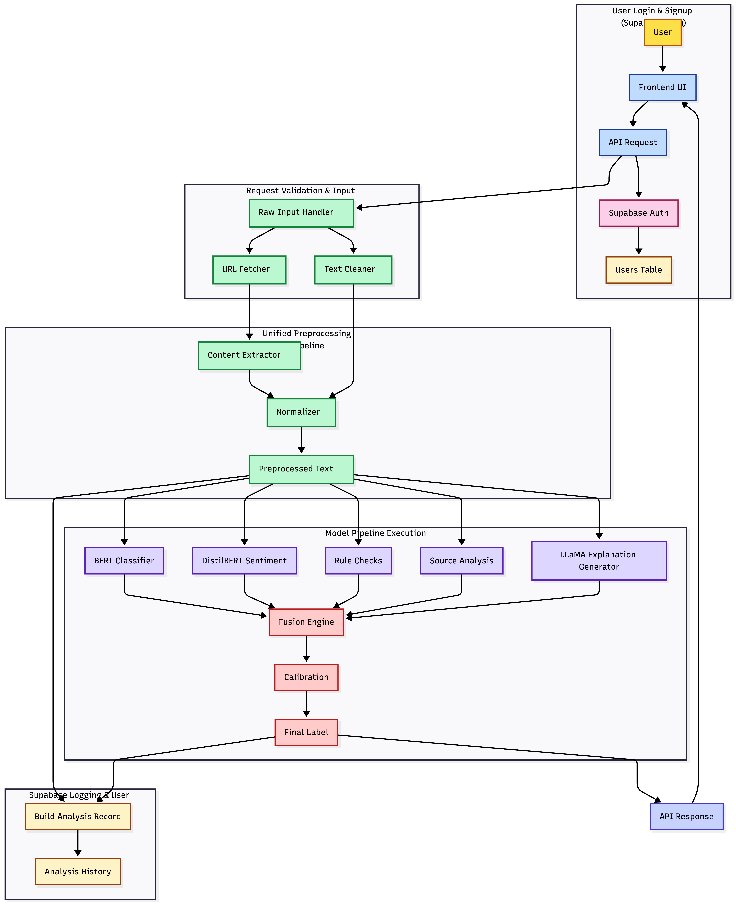
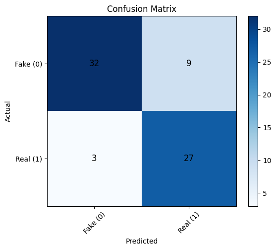
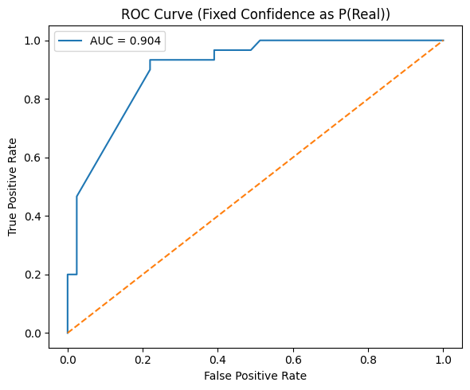

# NewsLogic — AI-Powered Fake News Detection System

Paste in a news article URL or raw text, get back a credibility verdict (**Real** / **Fake**) with a confidence score, risk flags, and a plain-language explanation of *why*. Built as a full-stack applied-AI system: transformer ensemble for detection, an LLM for explanations, and a deployed backend with auth, history, and audit logging.


## How it works

1. **Secure login** — Supabase auth issues a JWT; every request and history entry is tied to the user (row-level security).
2. **Submit text or a URL** — URLs are normalized, fetched, and article text is extracted; plain text goes straight to preprocessing.
3. **Preprocessing** — cleaning, normalization, segmentation for long inputs, tokenization.
4. **Parallel model inference**
   - **BERT-tiny** credibility classifier (primary, ensemble weight 0.70)
   - **DistilBERT / Twitter-RoBERTa** sentiment and emotional-tone evaluator
   - **Rule-based detectors** for rhetorical red flags (exaggeration, charged language, unsupported claims)
   - **Source validator** for domain-level credibility signals
5. **Ensemble fusion** — weighted scoring, consistency checks, and confidence thresholding into one credibility label.
6. **Explanation generation** — LLaMA-4-Scout-17B via Groq writes a narrative summary of the linguistic patterns and cues behind the verdict.
7. **Display + logging** — the Lovable/React frontend shows the result; everything is stored in Supabase as auditable user history.

Environment-managed execution: local models in development, Hugging Face Inference API fallback in production. Deployed via GitHub → Render CI/CD (Uvicorn/FastAPI).





## Evaluation

Evaluated on **71 labeled news items** pulled from the deployed app's own analysis history — real user submissions with noisy text, mixed lengths, and incomplete articles, not a curated academic set.

| Metric | Score |
|---|---|
| Accuracy | 83.10% |
| Precision (Real) | 0.75 |
| Recall (Real) | 0.90 |
| F1 | 0.818 |
| ROC AUC | ~0.91 |



32 true negatives, 27 true positives, 9 false positives, 3 false negatives. Most errors were Fake articles with neutral, professional-sounding language slipping through as Real — stylistic classification without factual grounding is the known boundary.



AUC ~0.91: in about 91% of Real-vs-Fake pairs, the model ranks the Real article higher — strong separation despite the lightweight models.

### Case studies

- **Reuters/Trump statements:** the DistilBERT fallback fired "Fake" at 99.7% on charged political rhetoric; BERT (99.9% Real) read the journalistic framing correctly, and the ensemble's BERT weighting carried the right verdict.
- **"Digital Access Tax" memo:** a fabricated but professionally written memo fooled BERT (99.9% Real) while DistilBERT caught the misinformation cues — but the ensemble still followed BERT. A clean illustration of style-vs-substance limits.

Full analysis, error patterns, ethics/governance, and limitations are in the [final report](docs/Final_Report.pdf).

## Tech stack

**Models:** BERT-tiny, DistilBERT / Twitter-RoBERTa, LLaMA-4-Scout-17B (Groq) · **Backend:** FastAPI, Uvicorn · **Infra:** Render (CI/CD), Supabase (auth, Postgres, RLS) · **Frontend:** Lovable/React · **Fallback:** Hugging Face Inference API

## Quickstart

```bash
pip install -r requirements.txt
python download_models.py
```

Create a `.env` file (never commit it — it's gitignored):

```
SUPABASE_URL=...
SUPABASE_KEY=...
GROQ_API_KEY=...
```

Then run the API:

```bash
uvicorn api:app --reload
```

POST text to `/analyze` and you'll get the credibility label, confidence, flags, and explanation as JSON.

## Responsible AI & limitations

Audit-logged predictions, encrypted data at rest/in transit, least-privilege access, and human-in-the-loop review — aligned with NIST AI RMF, OECD AI Principles, and the EU AI Act. Honest limits: text-only, no image/video analysis; classifiers judge *writing style*, not factual truth (no retrieval grounding); small-model context windows; LLM explanations can hallucinate.

## Credits

Built for *Applied AI for Functional Leaders* (IFSC 59903), Team Beta — December 2025.
